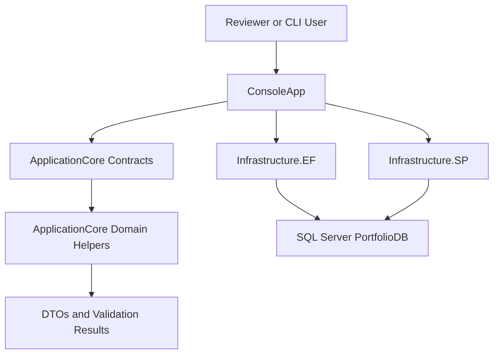
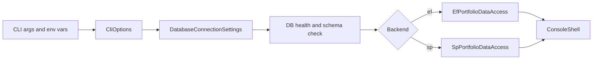
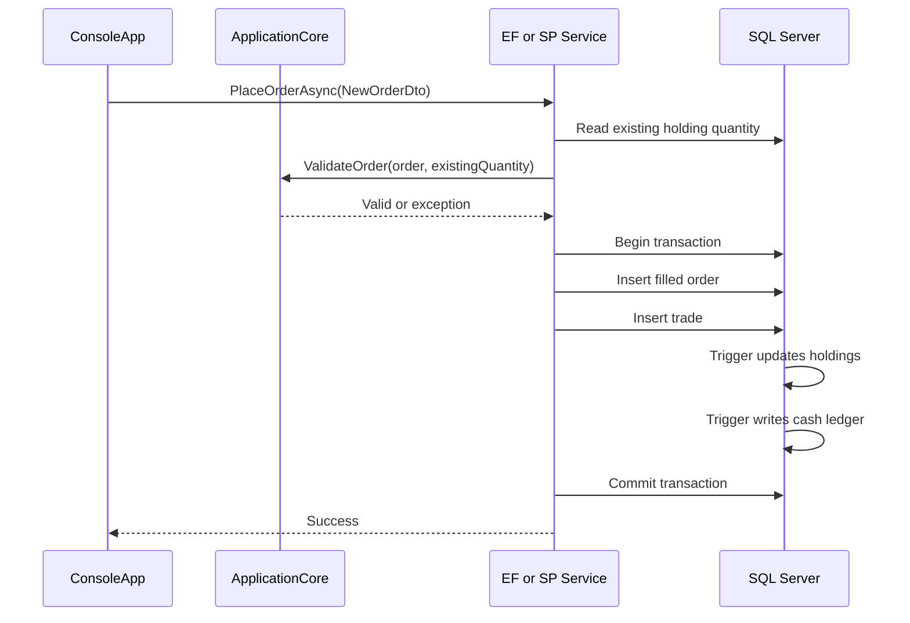

# Architecture

Portfolio Console Manager uses a layered architecture that keeps business rules independent from data-access technology. The console project is the composition root: it parses startup options, builds the selected backend, verifies the database, and runs either the interactive menu or the reviewer demo.

## Layered Design

## Project Responsibilities

| Project | Responsibility |
| --- | --- |
| `ApplicationCore` | DTOs, interfaces, order/account validation, realized P/L, contribution classification, return series, volatility. |
| `Infrastructure.EF` | EF Core DbContext, LINQ queries, EF transaction handling, EF implementation of account and portfolio services. |
| `Infrastructure.SP` | ADO.NET implementation, typed SQL parameters, stored-procedure calls, explicit transactions. |
| `ConsoleApp` | CLI parser, environment-based configuration, masked password prompt, health checks, menus, demo mode, backend composition. |
| `tests` | Unit tests for calculations and CLI behavior, plus optional SQL Server integration equivalence tests. |

## Runtime Composition

The console app no longer uses reflection to create data-access objects. Startup explicitly constructs the requested implementation:

- `--backend ef` creates a `PortfolioDbContext` and `EfPortfolioDataAccess`.
- `--backend sp` creates a `SqlConnectionFactory` and `SpPortfolioDataAccess`.

This makes dependencies visible, easier to debug, and easier to explain in interviews.

## Order Flow

Both backends follow the same order workflow and validation rules.

## Shared Business Rules

The strongest cleanup is that finance logic now lives in `ApplicationCore.Domain` instead of being duplicated across EF and SP services.

Shared helpers include:

- Realized P/L using average buy cost.
- Invested capital for snapshot return metrics.
- External contribution classification that ignores trade settlement cash flows.
- Fractional daily return series and cumulative return preview.
- Volatility over valid return points.
- Account validation and order validation.

That means EF and SP paths can differ in persistence strategy without drifting in business behavior.

## CLI Startup Behavior

The CLI supports both reviewer-friendly automation and normal interactive use:

- No arguments: show backend and connection menu.
- `--backend ef|sp`: start directly with the selected backend.
- `--demo`: run non-interactively and print account overview, holdings, trades, and return preview.
- `--no-seed`: skip app-side best-effort seeding when the SQL script already loaded deterministic data.
- `--help`: print supported options and environment variables.

Secrets are read from environment variables or masked prompts. The app never prints the real password in status lines.

## Error Handling Strategy

Before building either backend, the console opens a SQL connection and checks for the required core tables. If SQL Server is down or the schema is missing, the app reports a recovery path instead of failing with a raw provider exception.

At the service layer:

- EF uses transactions for multi-table writes.
- SP uses explicit `SqlTransaction` blocks and typed parameters.
- Sell orders are validated against existing holdings before inserts.
- SQL exceptions are wrapped with workflow-specific messages.

## Why This Architecture Is CV-Ready

The project is small enough to understand quickly but has real backend engineering substance: dependency boundaries, data-access interchangeability, SQL Server design, transactional writes, deterministic demo setup, and test coverage around the calculations that determine portfolio correctness.
