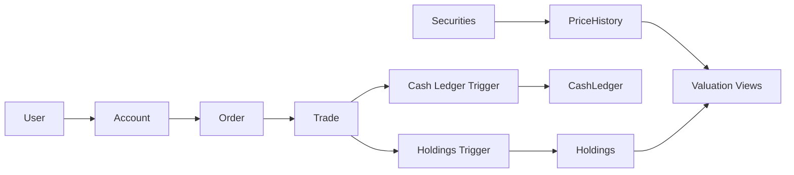

# Database Design

`PortfolioDB` is a SQL Server database for a brokerage-style portfolio console. The schema is normalized around users, accounts, securities, orders, trades, holdings, prices, and cash ledger activity.

The full setup lives in `db/PortfolioDB.sql`. It recreates the database, schema, indexes, views, triggers, stored procedures, and deterministic demo data in one script.

## Core Tables

| Table | Purpose |
| --- | --- |
| `Users` | Login/profile metadata for portfolio owners and admins. |
| `Accounts` | Account containers such as individual, retirement, or income portfolios. |
| `Securities` | Tradeable instruments with ticker, company name, sector, listing, and active flag. |
| `PriceHistory` | Daily OHLCV price data keyed by security and date. |
| `Holdings` | Current account positions with quantity and average cost. |
| `Orders` | Filled buy/sell order requests. |
| `Trades` | Executions tied to orders. |
| `CashLedger` | Deposits, withdrawals, and trade settlement cash movements. |
| `ComplianceRules` | Example rule metadata used to show extensibility. |

## Data Flow



## Triggers

`TR_Trades_AfterInsert_UpdateHoldings`

- Aggregates inserted trades by account/security.
- Adds buy quantities and subtracts sell quantities.
- Recalculates average cost only when a buy increases the position.
- Inserts a holding row if the account/security pair does not exist.
- Preserves a non-negative holdings invariant through the table constraint.

`TR_Trades_AfterInsert_CashLedger`

- Writes negative cash entries for buys.
- Writes positive cash entries for sells.
- Links cash movement to the originating trade with a `Trade:<id>` reference.

The application validates orders before insert, while the database still owns final consistency for holdings and cash movement.

## Views

`v_SecurityLatestPrice`

- Finds the latest close price per security.
- Supports current valuation queries without repeating window logic in every service method.

`v_AccountHoldingsValue`

- Joins accounts, users, securities, holdings, and latest price.
- Calculates market value and unrealized P/L.
- Serves both EF and SP implementations.

## Stored Procedures

`usp_GetPortfolioSnapshot`

- Accepts `@AccountID` and optional `@AsOfDate`.
- Finds the most recent price on or before the requested date.
- Returns account holdings, market value, unrealized P/L, and the effective as-of date.

`usp_GetSecurityReturnSeries`

- Accepts `@SecurityID`, optional `@StartDate`, and optional `@EndDate`.
- Returns price points and daily fractional returns.
- The application uses shared core logic to build the cumulative preview so EF and SP behavior remains equivalent.

## Indexing Choices

The script creates indexes for the most common access patterns:

- `IX_Accounts_UserID` for account lookup by user.
- `IX_Orders_Account_OrderDate` for recent order/trade history.
- `IX_Trades_Order_TradeDate` for trade lookup and realized P/L calculations.
- `IX_CashLedger_Account_TxnDate` for account cash activity and cash balance.
- `IX_Holdings_Account_Security` for order validation and position queries.
- `IX_Holdings_Account_NonZeroQty` for portfolio views that ignore closed positions.
- `IX_PriceHistory_Date_Security` for as-of price lookup and return-series queries.

## Deterministic Demo Data

The setup script seeds:

- 3 users.
- 3 accounts.
- 6 active securities: `MSFT`, `AAPL`, `NVDA`, `JPM`, `V`, and `JNJ`.
- 10 days of deterministic price history starting on `2026-01-02`.
- Initial deposits.
- Filled buy and sell orders.
- Trade rows that activate the holdings and cash-ledger triggers.

Because the data is generated in SQL, reviewers do not need CSV files or private local paths.

## Docker Setup

`docker-compose.yml` runs SQL Server 2022 Developer edition and mounts the local `db/` folder into the container as read-only.

Typical reset:

```bash
docker compose down -v
docker compose up -d
set -a
source .env
set +a
./scripts/setup-db.sh
```

The reset is intentionally destructive because this is a demo database. It gives reviewers a clean, repeatable state.

## Security and Configuration

The project does not store a real `sa` password in code or documentation. Use `.env` locally, environment variables in CI, or the masked console prompt during interactive startup.

Application connection precedence:

1. `PORTFOLIO_DB_CONNECTION`
2. CLI overrides
3. Individual `PORTFOLIO_DB_*` variables
4. local defaults without a password

## SQL Quality Notes

The stored-procedure backend uses typed `SqlParameter` helpers instead of `AddWithValue`. That avoids accidental type/length inference problems and makes SQL plans more predictable. Multi-step writes use explicit transactions so an order and its trade are committed together or not at all.
